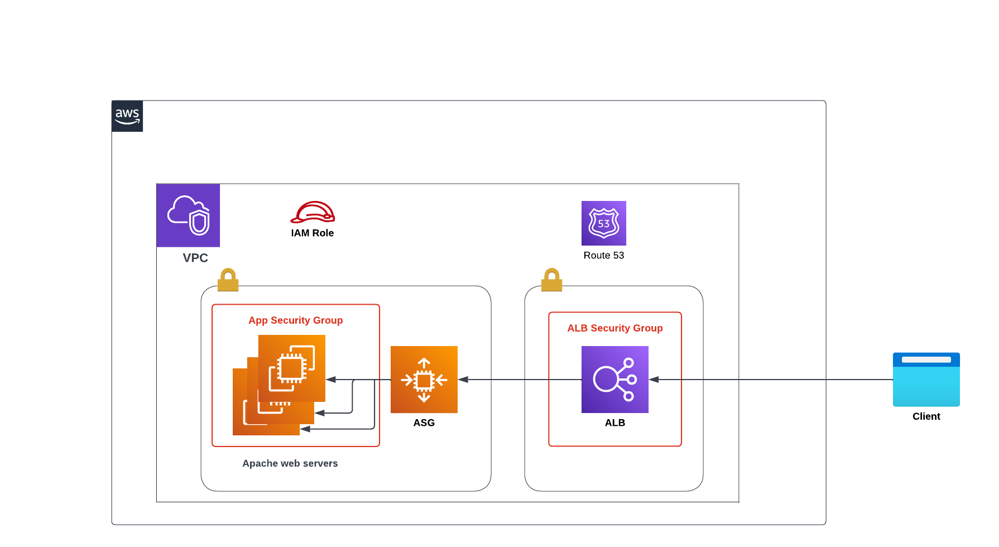

# Terraform Mastery Demo

## Creates AWS VPC, Subnets, ALB, ASG, Launch Template, Security Groups, Route53 record Using Terraform

This repo will use Terraform to setup VPC, subnets, Apache web servers in an ASG using launch template and security groups behind the ALB. The intent of this exercise is to demonstrate the use of Terraform to setup an entire application including the networking and Route53 record. The diagram below shows what will be set up.

  

  

---
### Prerequisites

- An AWS CLI profile as described [here](https://docs.aws.amazon.com/cli/latest/userguide/cli-configure-profiles.html). Terraform version 1.3.9 installed on local machine as describe [here](https://developer.hashicorp.com/terraform/downloads) 

---
### Resources

The following resources will be set up by each of the modules

### VPC
- 3 public subnets
- 3 private subnets 
- Internet Gateway (IGW)
- A route table for the subnets to the IGW 

### AutoScaling Group (ASG)
- A security group that allows requests to/from the internet
- An EC2 Launch template that sets up an Apache web server, and creates a default page with instances and EC2 metadata
- An Application Load Balancer (ALB) fronting the ASG

### IAM
- A policy that authorises usage of AWS API to consume EC2 metadata
- A role containing the above policy. This role is assigned to the ASG IAM Instance Profile
